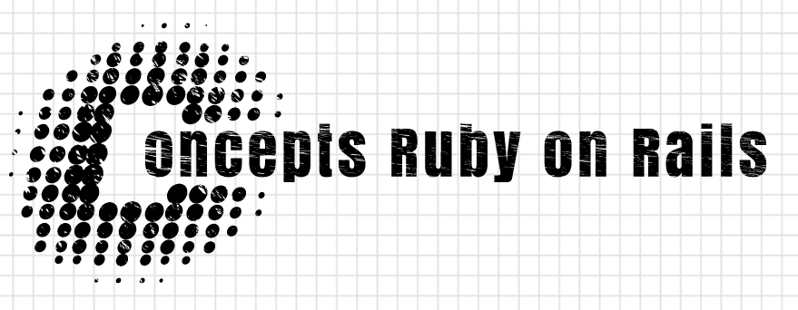

----------
> "Tu vas devoir donc *créer un repo GitHub* avec un README qui explique tous ces concepts, en **_vulgarisant un maximum._**"
>
> -- *Félix Gaudé*

## Concepts:
 +  _Site statique / dynamique_
 + _MVC_
 + _Routes_
 + _Databases_
 + _GET / POST_
 + _Migration_
 + _Relations entre modèles des BDD_
 + _CRUD_
------
### -La différence entre un site statique :zzz: et un site dynamique :running: ?
Lorem Ipsum

### -Que signifie l'acronyme M.V.C. ?
Lorem Ipsum

### -Les routes, comment ça marche :car: ?
Lorem Ipsum

### -Les bases de données ou 'databases' :cloud:
Lorem Ipsum

### -GET & POST :email:
Lorem Ipsum

### -La migration :wind:
Lorem Ipsum

### -Les modèles et leurs relations dans la base de données :blue_book:
Lorem Ipsum

### -C.R.U.D. 
Lorem Ipsum

------
### Merci de m'avoir lu ! :cat:
